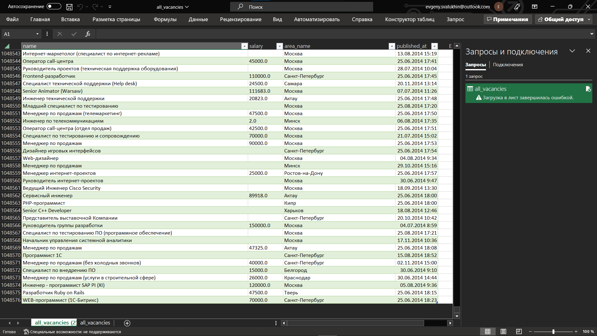

# 2.3.2

# 2.3.3

# 3.2.1

# 3.2.2
## Без использования multiprocessing

## С использованием multiprocessing

# 3.2.3
## С использованием concurrent_futures

# 3.3.1
## Частотность валют

### Итоговый файл с обработанными данными по валютам: "currency_by_month.csv"

# 3.3.2
### 1) Полный файл с обработанной информацией: "all_vacancies.csv" (закинут в .gitignore)
### Скриншот полного файла

### 2) Первые 100 значений из полного файла: "first_100.csv"

# 3.3.3
### Скриншоты полученных данных в файле "all_vacancies_yesterday.csv" (закинут в .gitignore)

# 3.4.1
### Полученный csv файл с первыми 100 значениями: "3_4_1.csv"

# 3.4.2
### Полученный pdf файл: "3_4_2.pdf"
### Введённые аргументы:
#### 1)Название вакансии: Программист

# 3.4.3
### Полученный файл: "3_4_3.html". Сделал html, а не pdf, так как pdfkit не умеет переводить русский текст
### Введённые аргументы:
#### 1)Название вакансии: Программист
#### 2)Название региона: Москва
